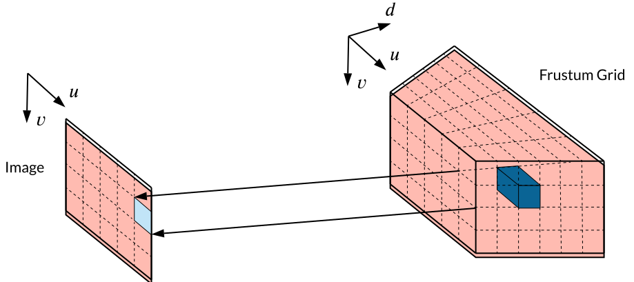
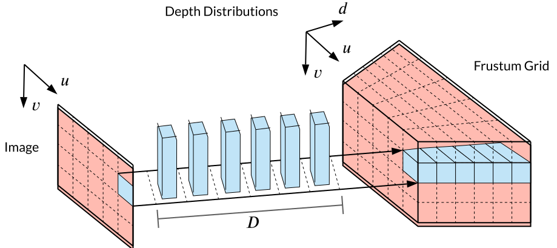
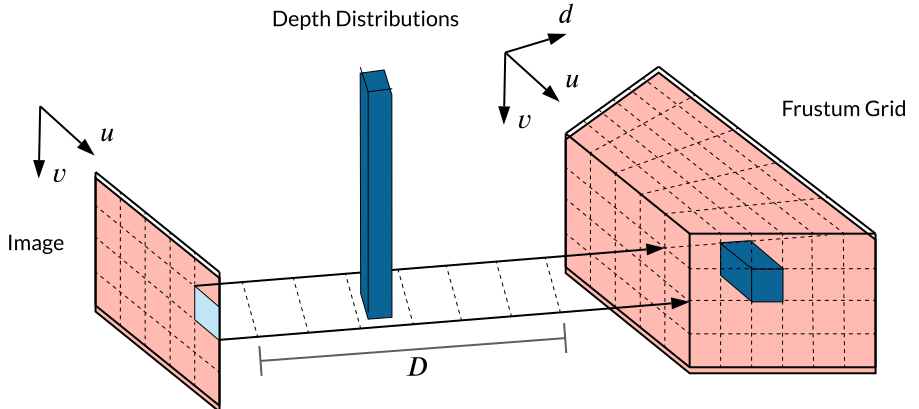
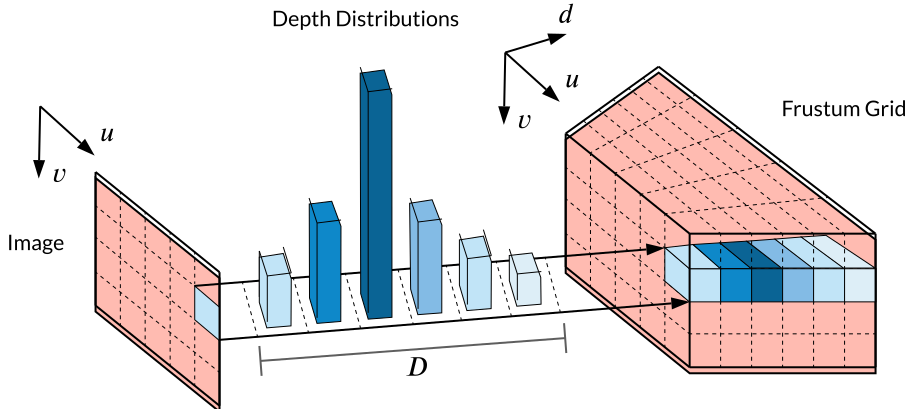
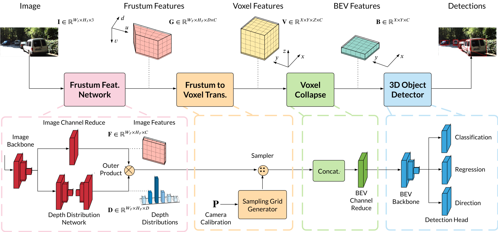
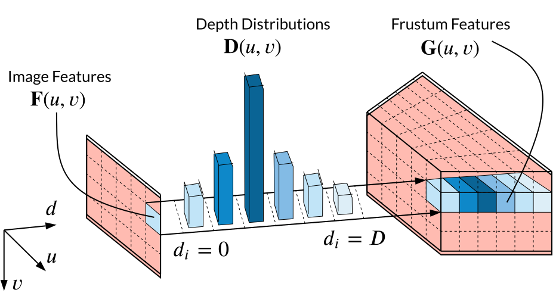
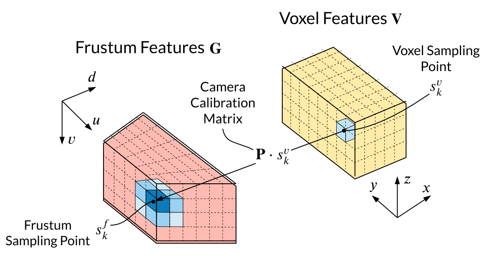

## About
<p style="text-align:center;">
</p>

CaDDN is a monocular 3D object detection pipeline that estimates a categorical depth distribution for each pixel to project image feature information to the appropiate depth interval in 3D space. We then use the bird’s-eye-view projection and single-stage detector to produce the final output detections.
#### Highlights
- 1<sup>st</sup> place on [KITTI 3D object detection benchmark](http://www.cvlibs.net/datasets/kitti/eval_object.php?obj_benchmark=3d) (among published monocular methods upon time of submission)
- 1<sup>st</sup> monocular method to report results on the [Waymo Open Dataset](https://waymo.com/open/)

---
## Paper
**[Categorical Depth Distribution Network for Monocular 3D Object Detection](https://arxiv.org/abs/2103.01100)**\
[Cody Reading](https://scholar.google.com/citations?user=VqvADvQAAAAJ&hl=en), [Ali Harakeh](https://www.aharakeh.com/), [Julia Chae](https://scholar.google.com/citations?user=U16kRHoAAAAJ&hl=en), and [Steven L. Waslander](https://scholar.google.com/citations?user=jY_Bcd8AAAAJ&hl=en)\
CVPR 2021 (Oral)
```
@article{CaDDN,
    title={Categorical Depth Distribution Network for Monocular 3D Object Detection},
    author={Cody Reading and
            Ali Harakeh and
            Julia Chae and
            Steven L. Waslander},
    journal = {CVPR},
    year={2021}
}
```

---
## Problem
The main problem in monocular 3D detection is due to the depth information loss when 3D scene information is projected onto the image plane. Without depth, accurately locating 3D objects is challenging.
<p style="text-align:center;">
    
</p>

Many monocular methods attempt to recover the lost depth in order to project the pixels back into 3D space. We categorize these into the **Too Big** and **Too Small** approaches.

### Too Big
These approaches project each image to all possible depths, and allow the detection network to learn which projected image pixel locations are the most relevant.
<p style="text-align:center;">
    
</p>
Methods here tend to suffer from smearing effects, wherein similar image information can exist at
multiple locations in the projected space. Smearing
increases the difficulty of localizing objects in the scene.

### Too Small
These approaches learn a single depth value for each pixel, and project the pixel to a single depth in 3D space.
<p style="text-align:center;">
    
</p>
This solution would be ideal with perfect depth information. The issue is that monocular depth estimation can be inaccurate, particulary at long range. All projected image pixels are treated equally regardless of depth estimation uncertainty, resulting in poor localization where depth estimates are inaccurate.

---
## Our Solution
Our solution takes a **Just Right** approach. We project pixels to all possible depths and weigh the projection by estimated depth probabilities. The weighted projection allows CaDDN to place image information at the correct locations while encoding depth estimation uncertainty.
<p style="text-align:center;">
    
</p>
Specfically, CaDDN estimates categorical depth distributions for each pixel, that contain probabilities that each pixel belongs to a set of discrete depth bins. This can be thought of as performing pixel-wise classification between depth bins, where the classification probabilities are then used as multplicative weights during projection.

The full architecture of CaDDN is shown here:
<p style="text-align:center;">
    
</p>

The network is composed of three modules to generate 3D feature representations and one to perform 3D
detection. Frustum features **G** are generated from an image **I** using estimated depth distributions **D**, which are transformed into voxel
features **V**. The voxel features are collapsed to bird’s-eye-view features **B** to be used for 3D object detection

To generate frustum features **G**, image features **F** and depth distributions **D** are predicted in parallel using convolutional networks. These are combined via an outer product, which multiplies each feature pixel by its associated depth bin probabilities. By doing so, the image features are projcted into a 3D frustum grid.
<p style="text-align:center;">
    
</p>


<hr style="height:200px; visibility:hidden;" />

---
## Results

---
## Affiliations
[](https://robotics.utoronto.ca/)
[](https://www.trailab.utias.utoronto.ca/)
<hr style="height:60px; visibility:hidden;" />
